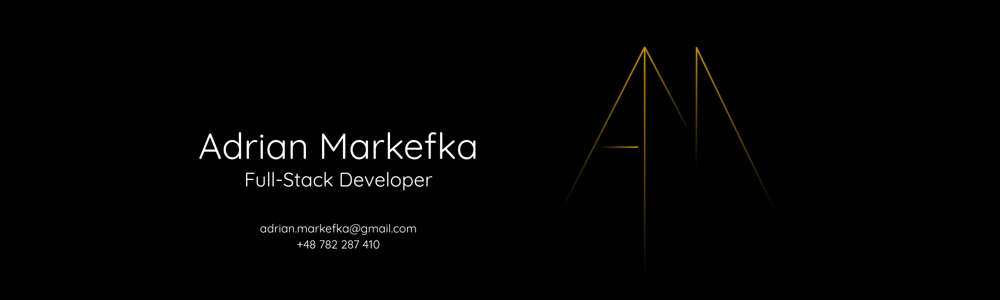

  

 

 
## 👨‍💻 About Me
 
Hey! I'm **Adrian Markefka** - a thorough, detail-obsessed developer who started on the frontend and never stopped learning. These days I'm building full-stack applications from the database schema all the way to pixel-perfect UIs.
 
I care deeply about **clean, maintainable code**, thoughtful architecture, and user experiences that actually make sense. If you have an idea for a web app or need a reliable developer on your team - let's talk.

---
 
## 🛠️ Tech Stack
 
### 🎨 Frontend
 

 
### ⚙️ State Management & Data Fetching

 
### 🖥️ Backend
 

 
### 🗄️ Database & ORM
 

 
### 🐳 DevOps & Infrastructure
 

 
### 🤝 Collaboration & Workflow
 

---
 
## 💬 Philosophy
 
> *"Any fool can write code that a computer can understand.*
> *Good programmers write code that humans can understand."*
> — Martin Fowler
 
I build things that are readable, maintainable, and ship without drama. Whether it's a database schema, a REST endpoint, or a React component — clean code is always the goal.
 
---
 

Got an idea? Let's build it. 🚀
 

 

