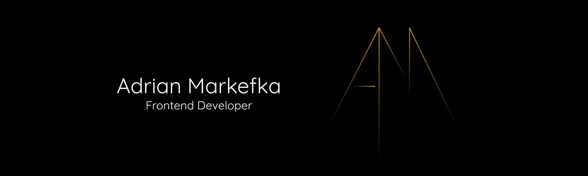

# Hi 👋
💻 I'm Adrian Markefka, a young Frontend Developer who constantly strives to explore and master new technologies. I'm thorough and meticulous. Writing simple and maintainable code is my priority. I'm not afraid of challenging, creative projects and enjoy taking on new challenges.
If you need help with your ideas for a website or app - feel free to contact me 📧

## 🎓 Skills:

-007ACC?style=flat-square&logo=axios&logoColor=white)

